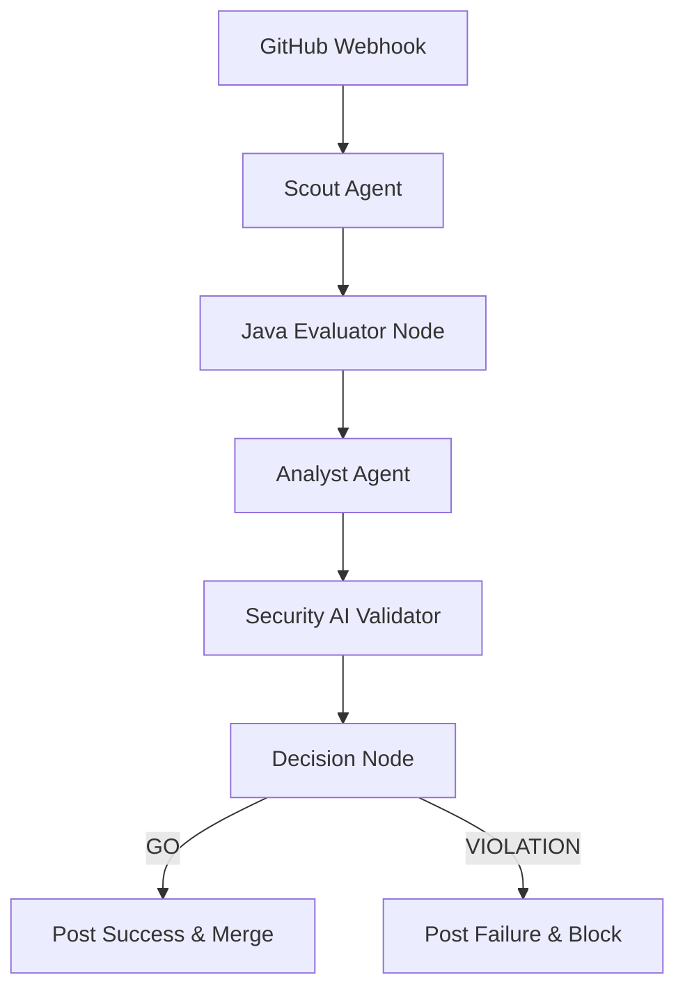

# 🛰️ Sentinel-SDLC: Multi-Agent Security Compliance

Sentinel-SDLC is a modern, AI-driven security compliance engine designed to gate Pull Requests with state-of-the-art semantic reasoning. It moves beyond legacy regex-based scanning by utilizing a Distributed Multi-Agent Graph to analyze code changes for deep security risks, PII exposure, and hardcoded secrets.

---

## 🏗️ Architecture: Multi-Agent Sentinel (RAV)

Sentinel operates as a **Retrieval-Augmented Validation (RAV)** system. When a webhook is received, it triggers a multi-stage LangGraph pipeline:



### 🧠 Core Components

- **`scout-agent`**: Fetches the PR diff and identifies the relevant enterprise standards.
- **`Java Evaluator`**: Performs deterministic regex-based secret and PII detection (Shield).
- **`analyst-agent`**: Performs deep semantic analysis using **LangChain-Python**.
- **`SecurityAIService`**: The heart of the Java Evaluator, using **LangChain4j** and **Google Gemini Flash** for high-speed security reasoning.

---

## 🛠️ Technology Stack

- **Orchestrator (Python)**: [FastAPI](https://fastapi.tiangolo.com/), [LangGraph](https://python.langchain.com/docs/langgraph), [PyGithub](https://github.com/PyGithub/PyGithub).
- **Evaluator (Java)**: [Spring Boot](https://spring.io/projects/spring-boot), [LangChain4j](https://github.com/langchain4j/langchain4j).
- **AI Engine**: [Google Gemini 2.0 Flash](https://deepmind.google/technologies/gemini/).
- **Infrastructure**: [Google Cloud Run](https://cloud.google.com/run), [GitHub Actions](https://github.com/features/actions).

---

## 🚀 Setup & Deployment

### 1. Environment Variables
Ensure the following variables are configured in **GCP Secret Manager**:

| Variable | Description |
| :--- | :--- |
| `GITHUB_APP_ID` | The ID of your GitHub App. |
| `GITHUB_PRIVATE_KEY` | The RSA private key for your GitHub App. |
| `GITHUB_WEBHOOK_SECRET` | The secret used to verify webhook signatures. |
| `GOOGLE_API_KEY` | Your Google AI (Gemini) API Key. |
| `EVALUATOR_URL` | The URL of the internal Java Evaluator service. |

### 2. Local Development
```bash
# Orchestrator
cd orchestrator
pip install -r requirements.txt
python main.py

# Evaluator
cd evaluator
./gradlew bootRun
```

### 3. Deployment
The services are automatically deployed to Google Cloud Run via the `.github/workflows/deploy.yml` pipeline.

---

## 🛡️ Usage: Sentinel PR Gating

Sentinel is enforced via **GitHub Branch Protection Rulesets**. 
1. Open a Pull Request.
2. The **Sentinel Compliance Check** will trigger automatically.
3. If the AI detects a violation (e.g., hardcoded credentials or unauthenticated internal calls), the check will fail and block the merge.
4. Review the detailed agent trace in the PR comments to remediate the findings.

---

> [!TIP]
> **Performance**: The system uses **Gemini 2.0 Flash** for ultra-low latency semantic scans, typically completing a full PR analysis in under 10 seconds.

*Powered by Sentinel-SDLC • Built for Enterprise Governance*
