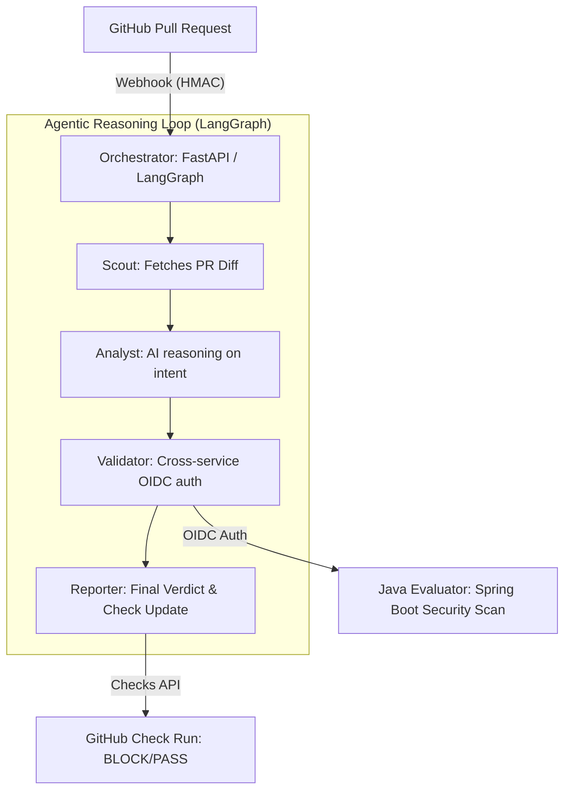

# Sentinel-SDLC 🛡️🚀

**Sentinel-SDLC** is an Agentic AI Platform designed to automate the AI Development Life Cycle (DLC) for high-compliance environments. It serves as an autonomous gatekeeper within the Pull Request workflow, enforcing security architectures, deterministic compliance rules, and AI-driven reasoning before human review.

---

## 🏗️ System Architecture

Sentinel-SDLC uses a multi-agent orchestration pattern powered by **LangGraph**, integrated with a deterministic **Java/Spring Boot** evaluator for rigid safety checks.



---

## ✨ Key Features

- **Agentic Orchestration (LangGraph)**: Specialized Python-based agents (Scout, Analyst, Validator, Reporter) operate inside a state-machine loop incorporating LLM reasoning.
- **Formal PR Blocking (Checks API)**: Instead of just commenting, Sentinel creates a **"Sentinel Compliance Check"** that formally blocks non-compliant PRs from merging.
- **Deterministic Scanning**: Relegates specialized checks (e.g., AWS secrets scanning, PII detection) to a robust **Java 17 / Spring Boot** backend to eliminate LLM hallucinations.
- **Advanced Security Model**:
  - **HMAC Signature Verification**: All GitHub webhooks are verified for authenticity.
  - **OIDC Service-to-Service Auth**: Orchestrator-to-Evaluator communication is secured via Google ID tokens.
  - **Secret Management**: All sensitive credentials (GitHub keys, secrets) are managed in **GCP Secret Manager**.
- **Model Context Protocol (MCP)**: Modular integration endpoints for extending context:
  - `Jira MCP` for business requirement retrieval.
  - `Standards MCP` for schema/compliance rule exposure.
  - `Observability MCP` for querying GCP Cloud Trace and Datadog.

---

## 🛠️ Infrastructure & Deployment

The platform is built on **Google Cloud Platform (GCP)** for enterprise-grade scalability and observability.

### Components
- **Orchestrator**: Python FastAPI service running in **Cloud Run**.
- **Evaluator**: Java Spring Boot service running in **Cloud Run (Private access)**.
- **Database/Storage**: GCP Secret Manager, Artifact Registry.
- **CI/CD**: GitHub Actions pipeline for automated builds and deployment via **Workload Identity Federation (WIF)**.

### Terraform Setup
The infrastructure is fully defined as code in `/terraform`.
```bash
cd terraform
terraform init
terraform apply
```

### CI/CD Deployment
The pipeline in `.github/workflows/deploy.yml` handles:
1. Docker image generation and push to Artifact Registry.
2. Deployment to Cloud Run with automatic secrets mounting.
3. Environment injection (EVALUATOR_URL, GITHUB_APP_ID).

---

## 🚀 Getting Started

### 1. GitHub App Configuration
Sentinel-SDLC requires a **GitHub App** to be created and installed on your target repository.

**Required Permissions:**
- **Checks**: Read & Write (to block merges)
- **Pull Requests**: Read & Write (to fetch diffs and post comments)
- **Metadata**: Read-only (mandatory)

**Webhook Configuration:**
- **URL**: `https://your-orchestrator-url.a.run.app/api/github/webhooks`
- **Secret**: Set a strong webhook secret and store it in GCP Secret Manager.

### 2. Local Configuration
Create a `.env` file in the `orchestrator/` directory:
```env
GITHUB_APP_ID=3285966
GITHUB_WEBHOOK_SECRET=your_hmac_secret
GITHUB_PRIVATE_KEY=your_app_private_key_string
EVALUATOR_URL=https://your-evaluator-url.a.run.app
```

### 3. Running Locally
**Orchestrator (Python):**
```bash
cd orchestrator
pip install -r requirements.txt
uvicorn main:app --reload --port 8080
```

**Evaluator (Java):**
```bash
cd evaluator
./gradlew bootRun
```

---

## 📊 AI Evaluation Framework
Sentinel includes a localized evaluation suite in `/evaluation/dataset` for tracking the Precision and Recall of the multi-agent system.
```bash
cd evaluation
python3 evaluate.py
```

---
*Powered by Sentinel-SDLC • Autonomous Compliance Engineering*
