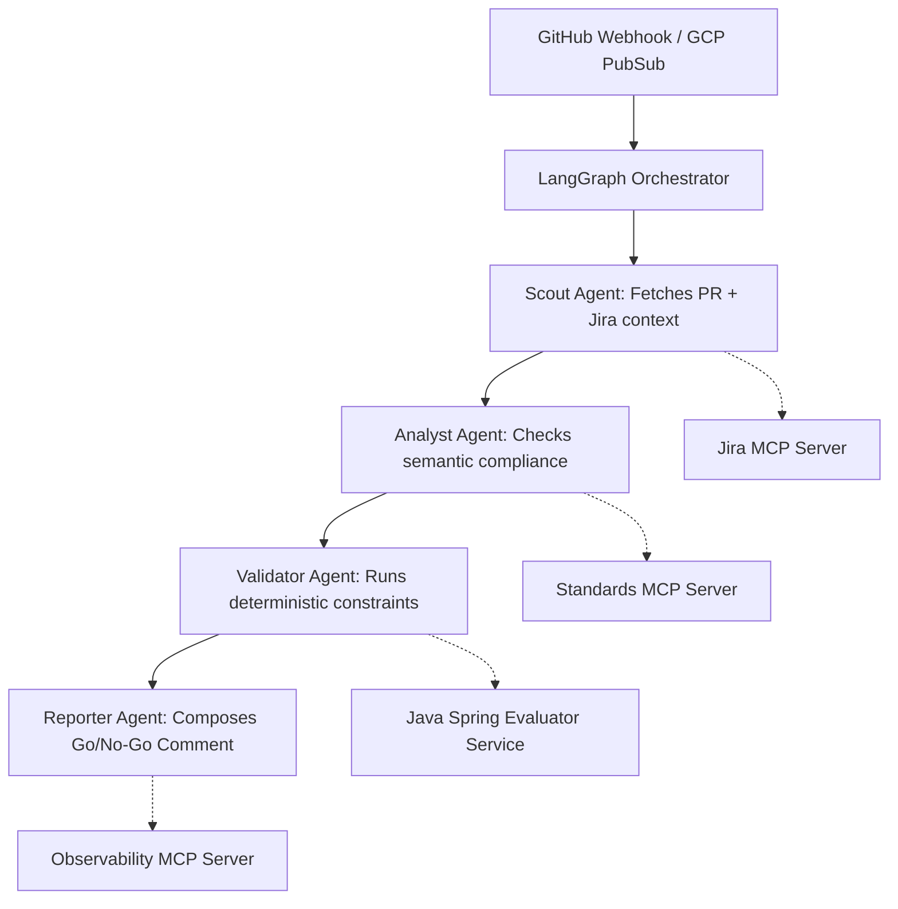

# Sentinel-SDLC

Sentinel-SDLC is a Principal-level Agentic AI Platform designed to automate the AI Development Life Cycle (DLC) for high-compliance environments. It transitions beyond simple code-assist by operating as an autonomous gatekeeper within the Pull Request workflow, enforcing custom data schemas, security architectures, and compliance rules before human review.

## Architecture

The system coordinates specialized agentic components connected via an event-driven infrastructure.



## Features

- **Multi-Agent Orchestration**: Powered by **LangGraph**, utilizing specialized Python-based agents (Scout, Analyst, Validator, Reporter) inside a state-machine loop incorporating LLM reasoning.
- **Deterministic Evaluation**: Relegates non-negotiable checks (e.g., regex secrets scanning, PII formatting) to a robust Java 17 / Spring Boot backend to prevent LLM hallucination overrides.
- **Model Context Protocol (MCP) Clusters**: Modular integration endpoints ready to extend this backend *or* augment native IDEs via GitHub Copilot interfaces:
  - `Jira MCP` for business context retrieval.
  - `Standards MCP` for schema/compliance rule exposure.
  - `Observability MCP` to query logging aggregators like Datadog or GCP Cloud Trace.
- **AI Evaluation Framework**: A locally packaged evaluation suite of "Golden Dataset" PRs used to iteratively track the Precision, Recall, and F1 scores of the multi-agent system.
- **Enterprise Observability**: Integrated with OpenTelemetry configuration to intercept and sink detailed traces of the agentic reasoning loops.
- **Infrastructure as Code**: Terraform structures for deploying into GCP via Cloud Run and Pub/Sub.

## Prerequisites

- Python 3.11+
- Java 17+
- Google Cloud SDK & Terraform (for deployment)

## Setup & Execution

### 1. The Multi-Agent Orchestrator
Install standard Python dependencies and start the LangGraph Webhook server.

```bash
cd orchestrator
python3 -m venv venv && source venv/bin/activate
pip install -r requirements.txt
uvicorn main:app --reload --port 8000
```

### 2. Evaluator Microservice
The rigid deterministic safety net.

```bash
cd evaluator
./gradlew bootRun
```

### 3. MCP Servers
Start up the targeted contexts. Note: you must use an MCP client or attach to your specific tools.

```bash
# Evaluate mock standards locally
python3 mcp-servers/standards/server.py

# Evaluate Jira / Datadog observability clusters similarly
python3 mcp-servers/jira/server.py
```

### 4. Golden Dataset Evaluation
To test the reliability of Sentinel-SDLC, you can run the localized ML ops script to pipe test PRs through the state machine.

```bash
cd evaluation
python3 evaluate.py
```

## Infrastructure

Use the provided `/terraform` deployment files to spin up the GCP resources necessary to take Sentinel remote:

```bash
cd terraform
terraform init
terraform apply
```

This maps standard GitHub App webhooks natively to GCP Pub/Sub endpoints, providing robust message delivery retries into the Orchestrator Cloud Run clusters.
