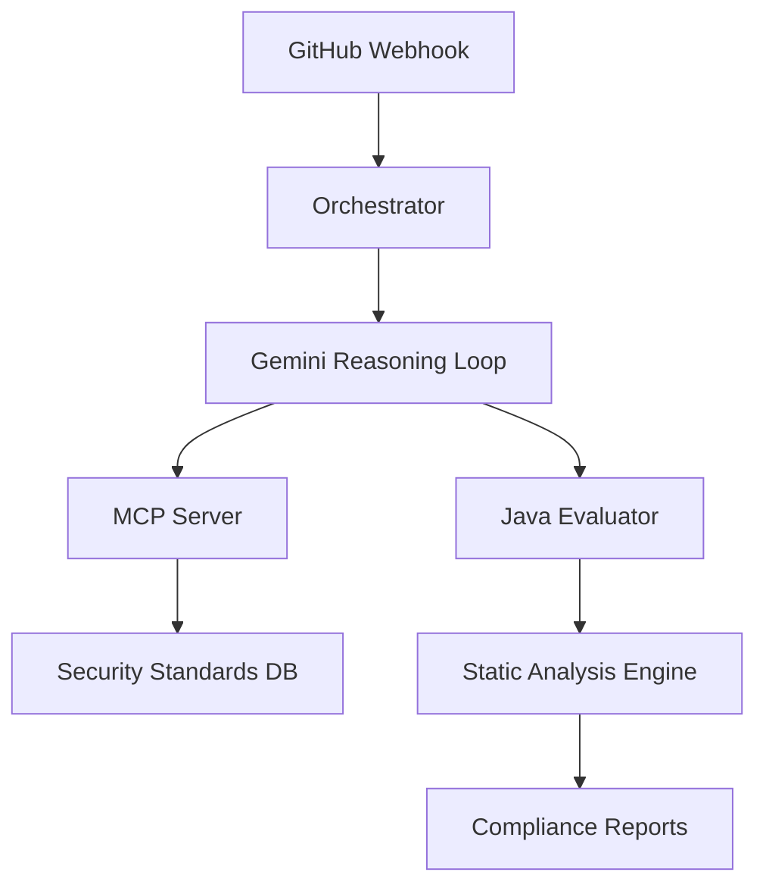

# Sentinel Agent Core

Sentinel is an AI-powered security agent that integrates with GitHub to monitor code changes and enforce enterprise security standards. It uses a modular architecture with a Python-based Orchestrator, a Java-based Evaluator, and a standards-aware MCP server.

## Architecture



## Prerequisites

- Python 3.8+
- Java 17+
- Docker (for containerized deployment)
- Google Cloud SDK (for Terraform deployment)

## Installation

### 1. Clone the Repository

```bash
git clone https://github.com/yourusername/sentinel-agent-core.git
cd sentinel-agent-core
```

### 2. Install Python Dependencies

```bash
pip install -r orchestrator/requirements.txt
pip install -r mcp-server/requirements.txt
```

### 3. Build the Java Evaluator

```bash
cd evaluator
./gradlew build
```

## Configuration

### Environment Variables

Create a `.env` file in the root directory:

```env
# GitHub Configuration
GITHUB_TOKEN=your_github_token
GITHUB_WEBHOOK_SECRET=your_webhook_secret

# Google Cloud Configuration
GOOGLE_CLOUD_PROJECT=your-project-id
GOOGLE_CLOUD_REGION=us-central1

# Gemini Configuration
GEMINI_API_KEY=your_gemini_api_key

# MCP Server Configuration
MCP_SERVER_URL=http://localhost:8000
```

## Running the System

### Option 1: Local Development

Start the components individually:

```bash
# Start MCP Server
python mcp-server/server.py &

# Start Orchestrator
uvicorn orchestrator.main:app --reload &

# Start Evaluator (in a separate terminal)
cd evaluator
./gradlew bootRun
```

### Option 2: Containerized Deployment

Build the Docker images:

```bash
docker build -t sentinel-orchestrator ./orchestrator
docker build -t sentinel-evaluator ./evaluator
docker build -t sentinel-mcp ./mcp-server
```

Run with Docker Compose:

```bash
docker-compose up --build
```

### Option 3: Terraform Deployment

Deploy to Google Cloud:

```bash
cd terraform
terraform init
terraform apply
```

## Usage

### GitHub Integration

1. Create a GitHub App in your GitHub settings
2. Configure the webhook URL to point to your deployed orchestrator (e.g., `https://your-domain.com/api/github/webhooks`)
3. Set the webhook events to "Pull requests"
4. Install the app on your repository

### MCP Server

The MCP server provides access to security standards definitions:

```bash
# Get PCI-DSS standard
mcp get-tool-call get_security_standard '{"standard_name": "PCI-DSS"}'

# Get SOC2 standard
mcp get-tool-call get_security_standard '{"standard_name": "SOC2"}'
```

## Project Structure

```
sentinel-agent-core/
├── orchestrator/          # Python FastAPI application
│   ├── main.py            # Webhook endpoint and Gemini integration
│   └── requirements.txt   # Python dependencies
├── mcp-server/            # MCP server implementation
│   ├── server.py          # MCP server logic
│   ├── standards.py       # Security standards definitions
│   └── requirements.txt   # MCP dependencies
├── evaluator/             # Java Spring Boot application
│   ├── src/
│   │   ├── main/java/com/example/sentinel/evaluator/
│   │   │   ├── controller/  # REST API endpoints
│   │   │   └── service/     # Security scanning logic
│   │   └── test/java/com/example/sentinel/evaluator/
│   │       └── service/     # Unit tests
│   ├── build.gradle       # Gradle build configuration
│   └── gradlew            # Gradle wrapper
├── terraform/             # Terraform infrastructure code
│   ├── main.tf            # Cloud resources
│   ├── variables.tf       # Input variables
│   └── outputs.tf         # Output values
├── .env                   # Environment variables
└── README.md              # Project documentation
```

## Security Standards

The system supports the following security standards:

- **PCI-DSS**: Payment Card Industry Data Security Standard
- **SOC2**: System and Organization Controls
- **OWASP**: Open Web Application Security Project
- **DATA_FABRIC**: Enterprise data protection standards

## Testing

### Python Tests

```bash
pytest mcp-server/test_standards.py
```

### Java Tests

```bash
cd evaluator
./gradlew test
```

## Deployment

### Deploy to Google Cloud

```bash
cd terraform
terraform init
terraform apply
```

### Deploy to Kubernetes

```bash
# Apply Kubernetes manifests
kubectl apply -f k8s/
```

## Contributing

1. Create a feature branch
2. Make your changes
3. Test your changes
4. Submit a pull request

## License

This project is licensed under the MIT License - see the [LICENSE](LICENSE) file for details.
