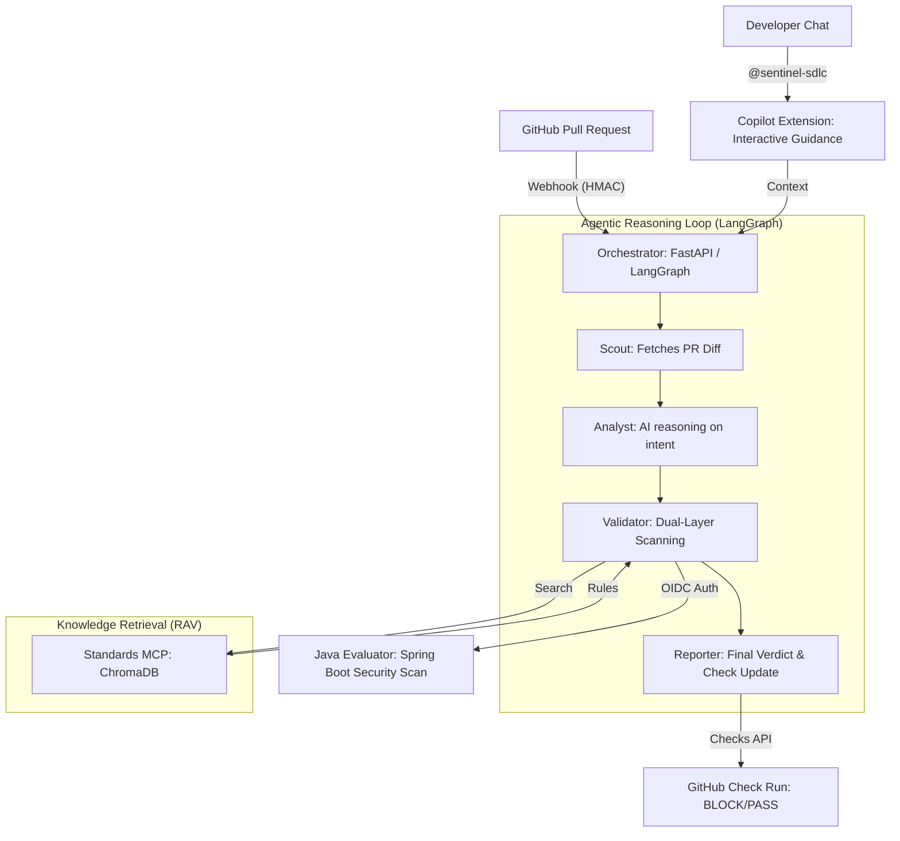

# Sentinel-SDLC 🛡️🚀

**Sentinel-SDLC** is a Principal-level Agentic AI Platform designed to automate the AI Development Life Cycle (DLC) for high-compliance environments. It serves as an autonomous gatekeeper within the Pull Request workflow, enforcing security architectures, semantic compliance rules, and AI-driven reasoning before human review.

---

## 🏗️ System Architecture

Sentinel-SDLC uses a multi-agent orchestration pattern powered by **LangGraph**, integrated with a deterministic **Java/Spring Boot** evaluator and a dynamic **Vector Database (ChromaDB)** for knowledge retrieval.



---

## ✨ Key Features

- **Retrieval-Augmented Validation (RAV)**: Moves beyond hardcoded checks. Sentinel semantically searches enterprise standards (`standards.md`) using **ChromaDB** to find and enforce relevant rules for every PR.
- **Agentic Orchestration (LangGraph)**: Specialized Python agents (Scout, Analyst, Validator, Reporter) operate inside a state-machine loop incorporating LLM reasoning.
- **GitHub Copilot Extension**: Interact with Sentinel directly in your IDE. Developers can ask `@sentinel-sdlc` why a PR was blocked or how to remediate an architectural violation.
- **Formal PR Blocking (Checks API)**: Sentinel creates a **"Sentinel Compliance Check"** that formally blocks non-compliant PRs from merging.
- **Deterministic Scanning**: Relegates high-fidelity checks (e.g., regex secrets scanning) to a robust **Java 17 / Spring Boot** backend to eliminate LLM hallucinations.
- **Advanced Security Model**:
  - **HMAC Signature Verification**: All GitHub webhooks are verified for authenticity.
  - **OIDC Service-to-Service Auth**: Orchestrator-to-Evaluator communication is secured via Google ID tokens.
  - **Secret Management**: All sensitive credentials are managed in **GCP Secret Manager**.

---

## 🛠️ Infrastructure & Deployment

The platform is built on **Google Cloud Platform (GCP)** for enterprise-grade scalability and observability.

### Components
- **Orchestrator**: Python FastAPI service running in **Cloud Run**.
- **Evaluator**: Java Spring Boot service running in **Cloud Run (Private access)**.
- **Knowledge Base**: ChromaDB on-disk storage within the Standards MCP.
- **CI/CD**: GitHub Actions pipeline for automated builds and deployment via **Workload Identity Federation (WIF)**.

---

## 🚀 Getting Started

### 1. Compliance-as-Code
To change your organizational policies, simply edit **`mcp-servers/standards/standards.md`**. The system will automatically re-index these rules into ChromaDB for dynamic enforcement.

### 2. GitHub App Configuration
Sentinel-SDLC requires a **GitHub App** to be created and installed on your target repository.

**Required Permissions:**
- **Checks**: Read & Write (to block merges)
- **Pull Requests**: Read & Write (to fetch diffs and post comments)
- **Copilot Chat**: Read-only (required for Extension interface)

### 3. Copilot Extension Setup
1. Enable **Copilot Chat** in your GitHub App settings.
2. Set the **Copilot App URL** to `https://your-orchestrator-url.a.run.app/api/copilot`.
3. Mention `@sentinel-sdlc` in your IDE chat to start a conversation.

### 4. Running Locally
**Orchestrator (Python):**
```bash
cd orchestrator
pip install -r requirements.txt
uvicorn main:app --reload --port 8080
```

**Standards MCP (Python/ChromaDB):**
```bash
cd mcp-servers/standards
python3 server.py
```

---

## 📊 AI Evaluation Framework
Sentinel includes a localized evaluation suite in `/evaluation/dataset` for tracking the Precision and Recall of the multi-agent system.
```bash
cd evaluation
python3 evaluate.py
```

---
*Powered by Sentinel-SDLC • Autonomous Compliance Engineering*
